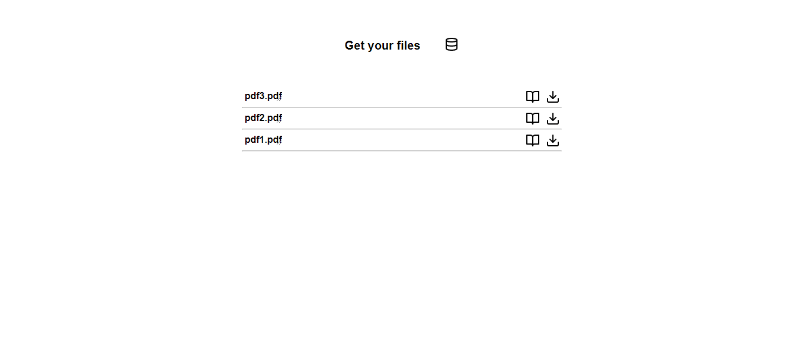

# Cross Port 

This project was created using the following javascript technologies [React](https://en.reactjs.org/), [electron](https://www.electronjs.org/) and [Express](https://expressjs.com/).

## Concept
With this desktop application, you select the files you want to share and a server is created, to which you can connect through a browser to download those files.

## Available Scripts
In the project directory, after installing all the dependencies with `$yarn install` you can run:
### `$yarn start`
Runs the app in the development mode.
### `$yarn build`
Compile the app for distribution with the .exe file in the dist folder.

## Demo

